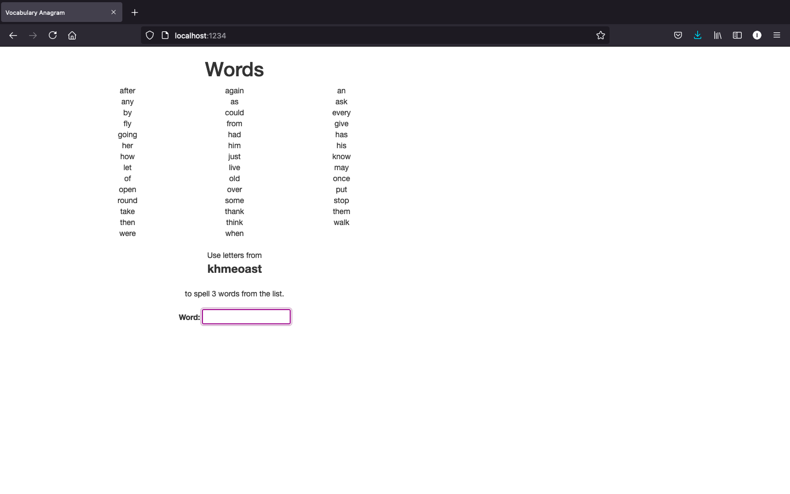

# Vocabulary Anagrams Game #
> **Author: Ellie Yun, yyun.ellie@gmail.com**
> 
A vocabulary anagrams game for primary school English Language Learners (ELL).

## Overview

A simple anagram game designed for English-language learning students in elementary and middle school. Students are presented with a list of vocabulary words (taken from a text file) and an anagram. The anagram is a jumble of some number of vocabulary words, randomly chosen. Students attempt to type words that can be created from the jumble. When a matching word is typed, it is added to a list of solved words.

The vocabulary word list is fixed for one invocation of the server, so multiple students connected to the same server will see the same vocabulary list but may have different anagrams.

## Getting started

`flask_vocab.py` is an example of the anagram game, with the template `vocab.html`. This example uses an AJAX interaction on each keystroke that the user enters in the text box. 

- Go to the ```vocab``` directory in the repository. 

- Build the simple flask app image using

      docker build -t <image name> .
      
- Run the container using
     
      docker run -d -p <host>:<port> <image name>
      
- In the web browser, search the following url:

      http://<host>:<port>/
    
    
    Then, play the game!

### Exploring the container
You can jump directly into your running container using the following command:

```shell
docker exec -it YOUR_CONTAINER_ID /bin/bash
```

This way you can run the tests, run another script, and really experiment with what goes on inside your container.


## FAQ
### What is `src`?
This is a sub-package which contains modules related to the game. You should not make any changes there, but feel free to review them to get a better understanding.

### What is `data`?
This directory contains a few word lists in the form of text files. You should not make any changes to the ones that already exist. However, you can add your own (but don't have to). You can change the word list file in your `credentials.ini`.

### How do I run the tests?
The `tests` directory contains a test suite for the `src` package. There's a `run_tests.sh`, which you can run in your container while it's running. However, it is not required, since you will not be changing anything in `src`. Before you run the tests, make a copy of `credentials-skel.ini` as `credentials.ini` and then update it as you needed. If not, it will use `app.ini` for configuration.

## Credits

Michal Young, Ram Durairajan, Steven Walton, Joe Istas, Ali Hassani.

